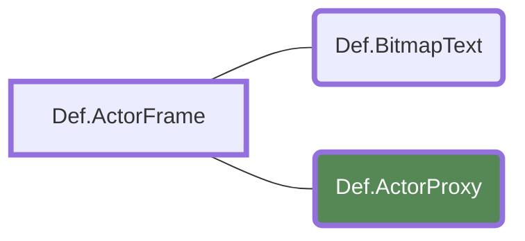
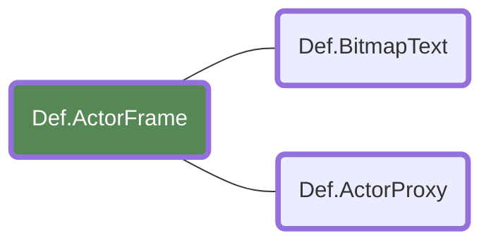
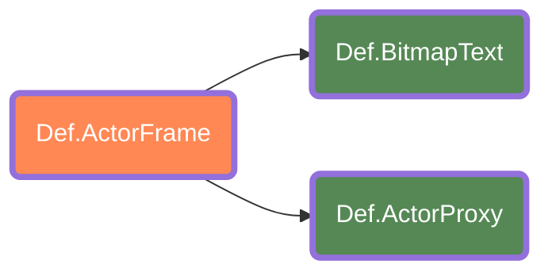

This is the base that everything derives from. Whatever an Actor can do, everything else can as well. It can be useful for creating control variables without creating something visible on screen.

```lua
-- Actors can be very useful as variable controllers since it does not perform any kind of
-- overhead to the draw pipe.

local Value = 2
Def.Actor{
    InitCommand=function(self)
        Value = Value + 2
        Trace("My Value is now ".. Value)
    end
}
```

# Attributes

| Name | Type | Description |
| :--- | :--- | ----------- |
[Name]Command | function | The basis for any command. Check [Commands](#commands) for more information.
Name | string | The name for the actor. Giving this a value allows this actor to be obtain by its name by any other actor. Check [Obtaining Childs and ActorFrame Levels](#obtaining-childs-and-actorframe-levels) for more information.
BaseRotationX | number | The base rotation for the X axis. Any rotation value is added ON TOP of this value.
BaseRotationY | number | The base rotation for the Y axis. Any rotation value is added ON TOP of this value.
BaseRotationZ | number | The base rotation for the Z axis. Any rotation value is added ON TOP of this value.
BaseZoomX | number | The base zoom for the X axis. Any zoom value is added ON TOP of this value.
BaseZoomY | number | The base zoom for the Y axis. Any zoom value is added ON TOP of this value.
BaseZoomZ | number | The base zoom for the Z axis. Any zoom value is added ON TOP of this value.

# Anatomy of an Actor

<!-- TODO: This is just getting started. If you've got ideas for this, please help out! -->

Every actor in SM5 follows a standard general structure, with [ActorFrame](/en/dev/actors/actortypes/actorframe) being more flexible in how they're constructed.

## General layout

```lua
Def.Actor {
	Name= "Example Actor",
	InitCommand= function(self) self:zoom(100) end,
	OnCommand= function(self) self:linear(2):x(30) end,
}
```

Every actor starts with a `Def.` prefix, followed by the actor type itself. An actor can have a name and commands. These commands could be anything, as long as it's suffixed with a `Command` or `MessageCommand`, depending on the type of commands needed.

Names allow one to easily grab the actor through functions like `GetChild`, but there are other exampled given later.

When the definition is complete, the actor has to be "returned" for the game to see it. Most of the time, [ActorFrame](/en/dev/actors/actortypes/actorframe) are usually what's returned instead of just a single actor.

## Commands

Commands come in two variants: "Commands" and "Messages".

Commands are usually isolated to a single actor, with a few exceptions. Messages are commands that are meant to be in multiple actors and can be invoked at around the same time on all actors with a "Broadcast".

> ** **
> ```lua
> MESSAGEMAN:Broadcast("SpecialMove", {funnymove = 10, absolute = false})
> ```
> 
> *This would run "SpecialMoveMessageCommand" on all actors that have this command defined, with a parameter table being passed in. Not all actors might use this table, even though they might have the command defined.*
> {.is-success}
> 

If one needs to manually queue a command or message, the `queuecommand` or `queuemessage` functions can be used.

These queued commands run only after all previous tweens have finished.

```lua
self:queuecommand("Action"):queuecommand("AnotherOne")

-- The actor itself
ActionCommand=function(self)
	-- an action is performed first
end
AnotherOneCommand=function(self)
	-- an action is performed after 'Action'
end
```

If a command has to run instantly, `playcommand` can be used for that.

```lua
self:playcommand("Action")

-- The actor itself
ActionCommand=function(self)
	-- an action is performed
end
```

If one wants to pass custom parameters into the command, a single table has to be used to wrap every parameter passed.

These command functions generally take two paramters: The actor calling the function (often called `self`), and the parameters table passed into the command. The paramters table is optional.

```lua
self:playcommand("Action", { --[[Values are added here like a regular table.]] })

-- example
self:playcommand("Action", { Value = 2 })

-- In the actor
ActionCommand=function(self,param)
	SCREENMAN:SystemMessage("I've got value which has ".. param.Value)
end
```
<!-- TODO: Document the difference between the two and add more notes!-->


# Obtaining Childs and ActorFrame Levels

When using [Actors](/en/dev/actors/actortypes/actor), you can use `self:GetParent()` and `self:GetChild()` to get elements from other [ActorFrames](/en/dev/actors/actortypes/actorframe) or [Actors](/en/dev/actors/actortypes/actor).

> `self:GetChild()` can only be used by [ActorFrames](../../actorframe).
{.is-warning}

You can think of an [ActorFrame](/en/dev/actors/actortypes/actorframe) as a tree of objects. This is the original table. And now you've called GetParent on the [ActorProxy](/en/dev/actors/actortypes/actorproxy).

```lua
Def.ActorFrame{
	Def.BitmapText{ Name="MyText" },
	* Def.ActorProxy{
		OnCommand=function(self)
			self:GetParent()
		end
	},
}
```



When calling it, you go back up a level, which in this case, it will become [ActorFrame](/en/dev/actors/actortypes/actorframe).



In this new location, we get the `MyText` actor, which can be achieved by calling the GetChild command, and can also return back to the [ActorFrame](/en/dev/actors/actortypes/actorframe), as we're now in a level that can get both actors *(shown in orange)*.

```lua
Def.ActorFrame{
	* Def.BitmapText{ Name="MyText" },
	Def.ActorProxy{
		OnCommand=function(self)
			self:GetParent():GetChild("MyText"):spin()
		end
	},
}
```



The command uses a String argument, but can also grab from nested tables in case of an [ActorFrame](/en/dev/actors/actortypes/actorframe) not having actors with names assigned. On those cases, actors are just indexed on that [ActorFrame](/en/dev/actors/actortypes/actorframe) set.

## Example Without Names

```lua
Def.ActorFrame{
	OnCommand=function(self)
		-- If we want to get to the BitmapText, we'll need to get
		-- the second entry on the ActorFrame.
		self:GetChild("")[2] -- returns the BitmapText actor.
	end,
	Def.Sprite{},
	Def.BitmapText{}
}
```

## Example With Names

```lua
Def.ActorFrame{
	OnCommand=function(self)
		-- If we want to get to the BitmapText,
		-- we'll need to get the "Text" actor.
		self:GetChild("Text") -- returns the BitmapText actor.
	end,
	Def.Sprite{ Name = "Image" },
	Def.BitmapText{ Name = "Text" }
}
```
